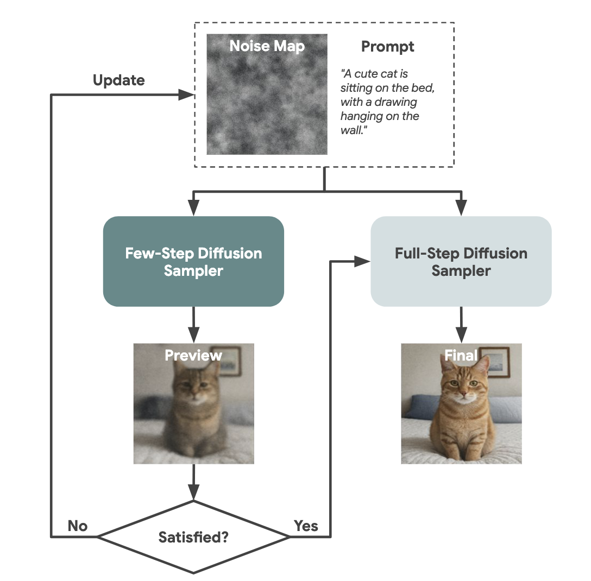
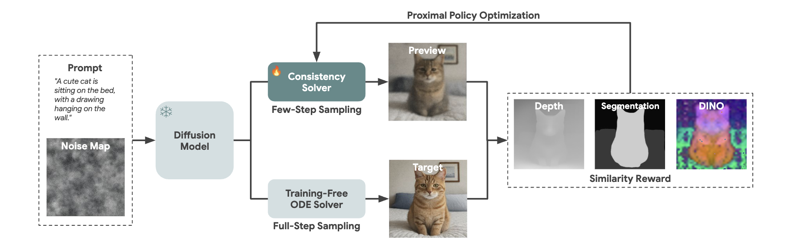
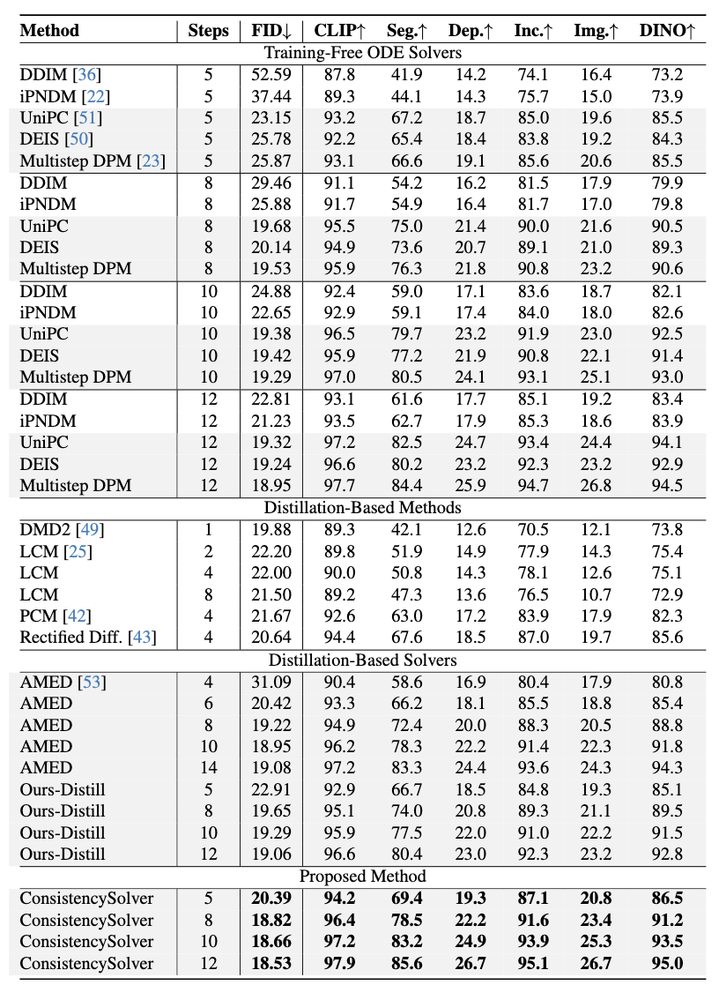
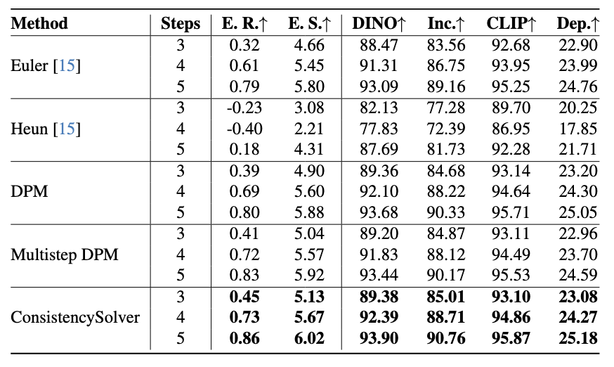

# Image Diffusion Preview with Consistency Solver

\- [Quick Start](#)  - [Overview](#overview) - [Results](#results) - [Setup](#setup) - [Training](#training) - [Generation & Evaluation](#gen--eval) - [Citation](#citation) - [Contact](#contact)

[](https://arxiv.org/abs/2512.13592)   [](https://huggingface.co/wangfuyun)

> Unofficial implementation

> **Image Diffusion Preview with Consistency Solver**  
> Fu-Yun Wang¹'², Hao Zhou¹, Liangzhe Yuan¹, Sanghyun Woo¹, Boqing Gong¹, Bohyung Han¹, Ming-Hsuan Yang¹, Han Zhang¹, Yukun Zhu¹, Ting Liu¹, Long Zhao¹  
> ¹Google DeepMind, ²The Chinese University of Hong Kong


## Quick Start

```python
import torch
from diffusers import StableDiffusionPipeline, DDIMScheduler
from scheduler_ppo import PPOScheduler  
from huggingface_hub import hf_hub_download


factor_net_path = "[PATH TO THE WEIGHT FILE]"

# We provide an example weight file for the factor net: 
factor_net_path = hf_hub_download(
     repo_id="wangfuyun/consolver",
     filename="model.ckpt"
)
print(f"ConSolver factor_net downloaded:{factor_net_path}")


model_id = "stable-diffusion-v1-5/stable-diffusion-v1-5"  

scheduler_type = "ddim"  

prompt = "an astronaut is riding a horse on the moon, highly detailed, 8k"

num_inference_steps = 8         
guidance_scale = 3              
seed = 43                        
height = 512
width = 512

def load_pipeline(scheduler_type):
    if scheduler_type == "ppo":
        scheduler = PPOScheduler(
            beta_end=0.012,
            beta_schedule="scaled_linear",
            beta_start=0.00085,
            num_train_timesteps=1000,
            steps_offset=1,
            timestep_spacing="trailing",
            order_dim=4,
            scaler_dim=0,
            use_conv=False,
            factor_net_kwargs=dict(embedding_dim=64, hidden_dim=256, num_actions=11),
        )
    else:
        scheduler = DDIMScheduler.from_pretrained(
            model_id, subfolder="scheduler", timestep_spacing="trailing"
        )

    pipe = StableDiffusionPipeline.from_pretrained(
        model_id,
        scheduler=scheduler,
        # torch_dtype=torch.float16,
        safety_checker=None, 
    )

    if scheduler_type == "ppo" and factor_net_path is not None:
        weight = torch.load(factor_net_path, map_location="cpu")
        pipe.scheduler.factor_net.load_state_dict(weight)
        pipe.scheduler.factor_net.to("cuda")
        
    pipe = pipe.to("cuda")
    return pipe

generator = torch.Generator("cuda").manual_seed(seed)
pipe_ddim = load_pipeline("ddim")
image_ddim = pipe_ddim(
    prompt=prompt,
    num_inference_steps=num_inference_steps,
    guidance_scale=guidance_scale,
    generator=generator,
    height=height,
    width=width,
).images[0]
image_ddim.save("ddim_result.jpg")


generator = torch.Generator("cuda").manual_seed(seed)
pipe_ppo = load_pipeline("ppo")
image_ppo = pipe_ppo(
    prompt=prompt,
    num_inference_steps=num_inference_steps,
    guidance_scale=guidance_scale,
    generator=generator,
    height=height,
    width=width,
).images[0]
image_ppo.save("consolver_result.jpg")

```


<div align="center">
  <table>
    <tr>
      <td align="center">
        
      </td>
      <td align="center">
        
      </td>
    </tr>
    <tr>
      <td align="center">
        <em>DDIM</em>
      </td>
      <td align="center">
        <em>ConsistencySolver</em>
      </td>
    </tr>
  </table>
</div>


## Overview

The slow inference process of image diffusion models significantly degrades interactive user experiences. We introduce **Diffusion Preview**, a novel preview-and-refine paradigm that generates rapid, low-step preliminary outputs for user evaluation, deferring full-step refinement until the preview is deemed satisfactory. This workflow enables users to quickly iterate through different prompts or random seeds with minimal computational cost, only triggering expensive full-step sampling when a preview meets their expectations.

<div align="center">
  
  <br>
  <em>Diffusion Preview framework: Fast preview generation followed by full-step refinement.</em>
</div>


To achieve high-quality and consistent previews, we propose **ConsistencySolver**, a learnable high-order ODE solver derived from Linear Multistep Methods and optimized via Reinforcement Learning. Unlike existing training-free solvers that rely on rigid numerical schemes or distillation methods that sacrifice consistency, ConsistencySolver dynamically adapts its integration strategy to maximize alignment between low-step previews and high-step reference generations, ensuring previews serve as reliable proxies for final outputs.

<div align="center">
  
  <br>
  <em>Overview of our RL framework for optimizing a learnable ODE solver in diffusion sampling.</em>
</div>

## Results

Empirical validation demonstrates that ConsistencySolver significantly outperforms training-free ODE solvers (e.g., `DDIM`, `UniPC`, `Multistep DPM`), distillation-based methods (e.g., `LCM`, `PCM`, `DMD2`), and distillation-based solvers (e.g., `AMED`) across both consistency metrics and FID scores. 


<div align="center">
  
  <br>
  <em>Quantitative Results on Stable Diffusion v1-5 for Text-to-Image Generation.</em>
      <br>
</div>

---

<div align="center">
  
  <br>
  <em>Quantitative Results on Flow Matching Model FLUX-Kontext for Instructional Image Editing.</em>
</div>

## Setup

### Stable Diffusion v1-5

1. Install environment

```bash
# Create conda environment
conda create -f env.yaml
conda activate preview

# Install CLIP
pip install git+https://github.com/openai/CLIP.git
```

2. Download datasets

```bash
# Download LAION dataset
wget -c https://huggingface.co/datasets/laion/laion2B-en-aesthetic/resolve/main/part-00000-cad4a140-cebd-46fa-b874-e8968f93e32e-c000.snappy.parquet

# Download COCO 2017 validation set
wget -c http://images.cocodataset.org/zips/val2017.zip
wget -c http://images.cocodataset.org/annotations/annotations_trainval2017.zip

# Setup COCO directory
mkdir coco
mv val2017.zip coco/
mv annotations_trainval2017.zip coco/
cd coco
unzip val2017.zip
unzip annotations_trainval2017.zip
cd ..
```

3. Generate training samples

```shell
cd gen_pretrain
python generate_data.py --generation_path="samples/laion_2b_en/2k" --validation_path="[PATH TO YOUR PARQUET FILE](Optionally, the path to part-00000-cad4a140-cebd-46fa-b874-e8968f93e32e-c000.snappy.parquet)" \
    --cfg=3.0 --seed 0 --num_inference_steps 40
```

This will automatically generate 2, 000 samples with 8GPUs (Modify the specific numbers if you are using different device config) including

```shell
--{gpu_id}_{idx}.txt # text file containing image captions
--noise_{gpu_id}_{idx}.pth # random noise samples
--latent_{gpu_id}_{idx}.pth # image latent generated with 40 step multistep dpmsolver with the above caption and initial noise
```

### FLUX-Kontext

1. Install environment

```shell
cd edit_ppo/edit_pretrain

conda env create -f env.yaml
conda activate preview_flux
pip install git+https://github.com/openai/CLIP.git
pip install git+https://github.com/huggingface/diffusers.git
```

2. Download datasets

```shell
python prepare_data.py
```

This will automatically download 2k samples from `OmniEdit-Filtered-1.2M`. 

3. Generate training samples

```shell
python generate.py
```

This will automatically generation 2, 000 samples by FLUX-Kontext. Then we have the `data` folder with 

```shell
--data/ref_images/{idx}.png # reference image
--data/prompts/{idx}.txt # editing instruction 
--data/edited_images/{idx}.png # edited images with FLUX-Kontext
--data/initial_noises/{idx}.pt # initial random noise samples 
--data/obtained_noises/{idx}.pt # edited latents with FLUX-Kontext
```

## Training

For training experiments, simply run `run_ppo.sh` , which is 

```shell
PREFIX=depth_4order_cfg3_prod_num_action_11_1e-4
MODEL_DIR="stable-diffusion-v1-5/stable-diffusion-v1-5"
OUTPUT_DIR="outputs/$PREFIX"
PROJ_NAME="$PREFIX"
CUDA_VISIBLE_DEVICES=0 accelerate launch --main_process_port 29500  --num_processes=1 --config_file="accelerate_config.yaml" train_ppo.py \
    --pretrained_teacher_model=$MODEL_DIR \
    --output_dir=$OUTPUT_DIR \
    --tracker_project_name=$PROJ_NAME \
    --enable_xformers_memory_efficient_attention \
    --mixed_precision=fp16 \
    --resolution=512 \
    --learning_rate=1e-4 --loss_type="huber" --adam_weight_decay=1e-3 \
    --max_train_steps=3001 \
    --max_train_samples=4000000 \
    --dataloader_num_workers=16 \
    --validation_steps=100 \
    --checkpointing_steps=100 --checkpoints_total_limit=20 \
    --train_batch_size=80 \
    --gradient_accumulation_steps=1 \
    --cfg=3 \
    --use_8bit_adam \
    --resume_from_checkpoint=latest \
    --report_to=wandb \
    --seed=453645634 \
    --order_dim=4 \
    --scaler_dim=0 \
    --ppo_epochs=1 \
    --factor_embedding_dim=1024 \
    --factor_hidden_dim=256 \
    --factor_num_actions=11 \
    --reward_type="depth" \
    --ppo_type="discrete" \
    --gradient_checkpointing 

```

For the training example of FLUX-Kontext, please refer to `edit_ppo/run_ppo.sh`. 

## Gen & Eval

Generation

1. For text-to-image generation, please refer to the examples shown in `gen.sh`.  In addition to the generation examples of our proposed consistency solver, we also provide the options including
   - `DDIM`
   - `DPM Solver`
   - `Multistep DPM Solver`
   - `IPNDM`
   - `UNIPC`
   - `DEIS`
   - `DMD2`
   - `AMED`

2. For instructional image editing with FLUX-Kontext, please refer to the examples shown in `edit_ppo/generate_ours.py` and `edit_ppo/generate_pretrain.py`. In additional to the generation examples of our proposed consistency solver, we also provide the options including
   - `Euler`
   - `Heun`
   - `DPM Solver`
   - `Multistep DPM Solver`

Evaluation

1. For FID testing, please refer to the example shown in `fid_test.py`.
2. For consistency metric testing, please refer to the example shown in `compute_reward.sh`.

## Citation

```bibtext
@misc{wang2025imagediffusionpreviewconsistency,
      title={Image Diffusion Preview with Consistency Solver}, 
      author={Fu-Yun Wang and Hao Zhou and Liangzhe Yuan and Sanghyun Woo and Boqing Gong and Bohyung Han and Ming-Hsuan Yang and Han Zhang and Yukun Zhu and Ting Liu and Long Zhao},
      year={2025},
      eprint={2512.13592},
      archivePrefix={arXiv},
      primaryClass={cs.LG},
      url={https://arxiv.org/abs/2512.13592}, 
}
```

## Contact

For questions and discussions, please contact: Fu-Yun Wang: [fywang0126(at)gmail.com](mailto:fywang0126@gmail.com)
